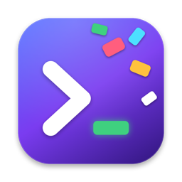
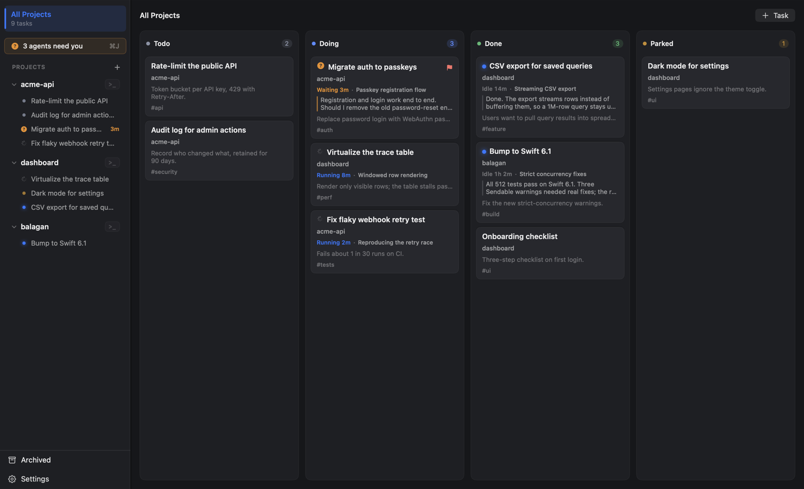
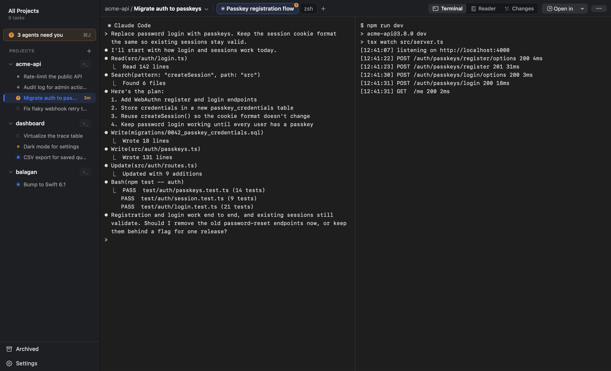
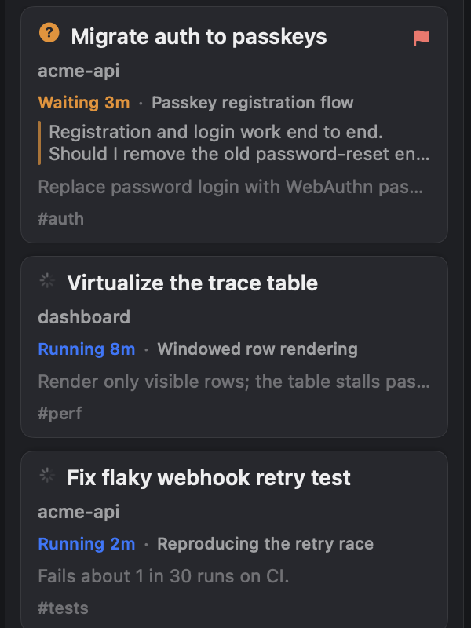
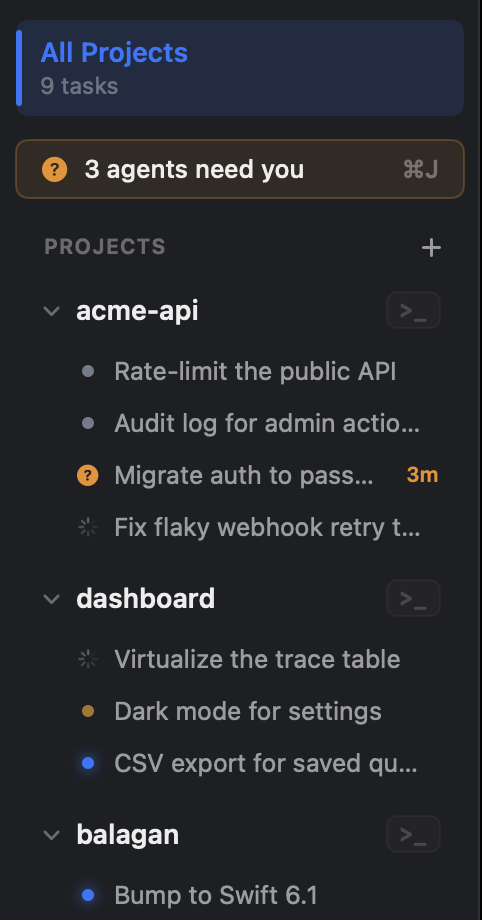
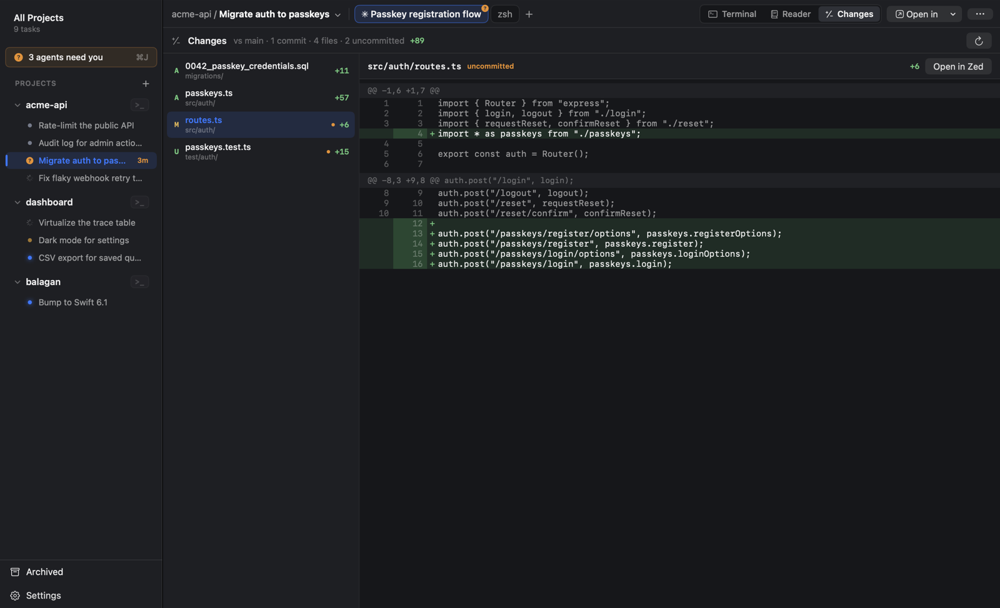
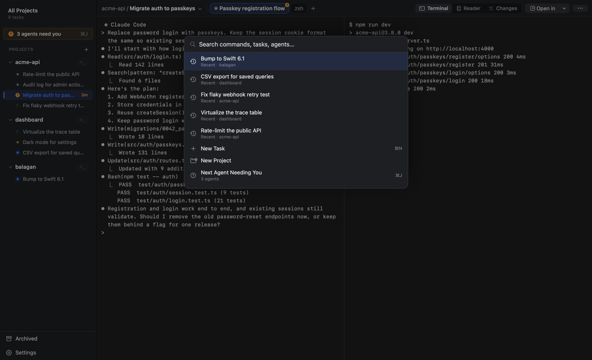

<div align="center">



<h1>Balagan</h1>

<p><b>A native macOS kanban board where every card is a terminal running a coding agent.</b><br>
Run Claude Code, Codex, OpenCode and pi side by side, and see at a glance which one needs you.</p>

<p>


</p>

<p>
<a href="#features">Features</a> ·
<a href="#supported-agents">Agents</a> ·
<a href="#install">Install</a> ·
<a href="#how-it-works">How it works</a> ·
<a href="#cli">CLI</a> ·
<a href="#keyboard-shortcuts">Shortcuts</a> ·
<a href="#faq">FAQ</a>
</p>



</div>

## Why Balagan?

*Balagan* (בלגן) is Hebrew for a total mess, which is what running six agents in six terminals turns
into.

Running more than one coding agent at a time turns into tab juggling quickly. One is waiting on a
permission prompt, another finished ten minutes ago, and a third is still running. Finding out which
is which means clicking through every terminal.

Balagan gives each piece of work a card, and each card owns a real terminal workspace with its own
tabs, splits and git worktree. The board shows what every agent is doing right now. One shortcut
takes you to the next agent that needs you, and when you're done you can review the diff without
leaving the app.

## Features

<table>
<tr>
<td width="40%">
<h3>Every card is a workspace</h3>
Open a card and you're in its terminals, which are real Ghostty surfaces with tabs and splits. The
agent, the dev server and a spare shell all live with the task they belong to.
</td>
<td width="60%"></td>
</tr>
<tr>
<td width="40%">
<h3>Live agent status on the card</h3>
Each card shows whether its agent is running, waiting for you, or finished, and for how long. It also
shows what the agent is working on and a preview of its last answer, so you can often decide without
opening it.
</td>
<td width="60%" align="center"></td>
</tr>
<tr>
<td width="40%">
<h3>Go to the next agent that needs you</h3>
<kbd>⌘J</kbd> jumps to the agent that has been waiting longest, then to ones that finished while you
were elsewhere. Press it again to walk the queue. Desktop notifications fire only when you're not
already looking, and clicking one takes you straight to that agent.
</td>
<td width="60%" align="center"></td>
</tr>
<tr>
<td width="40%">
<h3>Review what the agent changed</h3>
<kbd>⇧⌘G</kbd> swaps the terminal for the task's diff against where its branch started. It covers
commits, uncommitted edits and new files, and the terminal keeps running behind it.
</td>
<td width="60%"></td>
</tr>
<tr>
<td width="40%">
<h3>Everything is a keystroke away</h3>
<kbd>⇧⌘P</kbd> opens a palette with your recent tasks first, then every command, task and agent
session. Every shortcut can be rebound in Settings.
</td>
<td width="60%"></td>
</tr>
</table>

Beyond those, Balagan also has:

- **Sessions that survive restarts.** Quit the app or reboot, and reopening a task resumes each agent's
  session (`claude --resume`, `codex resume`, …) and replays plain shells.
- **Automatic sleep for idle tasks.** After 30 quiet minutes a task frees its terminals and memory, and
  it wakes exactly where it was.
- **Agents that update themselves don't cost you the tab.** If an agent exits right after starting, it
  resumes in place. Otherwise the tab stays with a **Resume ⏎** bar.
- **A git worktree per task**, created from the task title. Leave the branch blank to work on the
  main checkout.
- **Reader mode** (<kbd>⇧⌘R</kbd>) shows the agent's transcript as clean, readable prose, and
  <kbd>⇧⌘S</kbd> reads the last answer aloud.
- **Typing `claude`, `codex`, `opencode` or `pi` at any prompt** turns that tab into a tracked agent tab.
- **Native everywhere.** It's Swift, AppKit and SwiftUI on top of libghostty, with no Electron and no
  web view.

## Supported agents

| Agent | How Balagan knows its state | How it resumes |
|---|---|---|
| **Claude Code** | Hooks, including the instant permission-request signal | `claude --resume <session>` |
| **Codex** | Its terminal title (spinner / "Action Required") | `codex resume <session>` |
| **OpenCode** | A plugin, added alongside your own config | `opencode --session <session>` |
| **pi** | An extension | `pi --session-id <session>` |
| **Anything else** | Drop a JSON profile in `~/.balagan/agents/` | Whatever its `resumeArguments` say |

A custom profile can be this short:

```json
{ "id": "goose", "resumeArguments": ["session", "resume", "--name", "{session}"] }
```

## Install

Balagan embeds the terminal from [Ghostty](https://ghostty.org), so install **Ghostty 1.3.1**
in `/Applications` first. Then build and install the app:

```bash
git clone https://github.com/joeyfeldberg/balagan.git && cd balagan
make app                   # builds dist/Balagan.app
scripts/install-app.sh     # installs to /Applications and registers it with macOS
```

Use `install-app.sh` rather than copying the bundle yourself. Copying leaves duplicate LaunchServices
records behind, and macOS then silently refuses notifications. For banners, run
`scripts/make-signing-cert.sh` once before `make app` so the app gets a stable signature. Click
**Allow** when macOS asks.

### Quick start

1. Drop a project folder on the welcome screen, or choose one. The project uses your default agent,
   which you can change in Settings → Agents.
2. Press <kbd>⌘N</kbd>, give the task a title, and open it. Its agent starts in the first tab.
3. Go do something else. The card tells you when the agent is waiting or done, and <kbd>⌘J</kbd>
   takes you there.

## How it works

1. **Terminals are libghostty surfaces.** Balagan loads Ghostty's library at runtime, so you get its
   renderer, fonts and your own Ghostty config.
2. **Agents launch through a small wrapper, `balagan-agent`.** It captures the session id, installs
   that agent's hooks, plugin or extension, and reports state changes back over a local socket.
3. **The board stores sessions, not processes.** Each tab remembers its agent's session, so reopening
   a task, waking it, or restarting the app resumes the conversation.
4. **Each task can have its own git worktree**, so agents working in parallel don't step on each other.

Nothing leaves your machine. The board lives in a local SQLite database, and Balagan never reads
your prompts or the agent's output beyond its own transcript files.

## CLI

The packaged app puts a `balagan` command on your `PATH`, which drives the running app over a local
socket. It's handy for scripts, or for an agent that wants to hand work to another agent.

```bash
balagan tasks                                  # every task, with agent state (☾ = asleep)
balagan create --project acme-api --title "Rate-limit the public API" --eager
balagan open rate-limit-the-public-api         # jump to it in the app
balagan wait rate-limit-the-public-api --until idle
balagan state rate-limit-the-public-api        # running / needs-input / idle
balagan speak --dry-run                        # the last answer, as speakable text
```

`--eager` starts the new task's agent in the background right away. Add `--json` to any command for
machine-readable output.

## Keyboard shortcuts

These are the defaults. All of them can be rebound in Settings → Shortcuts.

| Shortcut | Action | | Shortcut | Action |
|---|---|---|---|---|
| <kbd>⇧⌘P</kbd> | Command palette | | <kbd>⌘T</kbd> | New tab |
| <kbd>⌘N</kbd> | New task | | <kbd>⇧⌘T</kbd> | New agent tab |
| <kbd>⌘J</kbd> | Next agent needing you | | <kbd>⌘D</kbd> / <kbd>⇧⌘D</kbd> | Split right / down |
| <kbd>⇧⌘G</kbd> | Review changes | | <kbd>⇧⌘↩</kbd> | Zoom pane |
| <kbd>⇧⌘R</kbd> | Reader mode | | <kbd>⌥⌘</kbd> + arrows | Move between panes |
| <kbd>⇧⌘S</kbd> | Speak last response | | <kbd>⇧⌘[</kbd> / <kbd>⇧⌘]</kbd> | Previous / next tab |

## FAQ

**How is this different from cmux, Vibe Kanban or Claude Squad?**
cmux is a terminal with great agent notifications, organised by window and workspace. Vibe Kanban is
a web board that runs agents for you. Claude Squad is a TUI over tmux. Balagan sits between them.
It's a native board where the unit is a *task*, and each task owns real terminals that you drive
yourself.

**Do my agents keep running after I quit?**
No. Terminal processes live inside the app. Their *sessions* survive, though, and reopening a task
resumes each agent where it left off.

**Can I use it with an agent that isn't listed?**
Yes. Add a JSON profile to `~/.balagan/agents/`. Without an integration you still get resume, plus
state from the terminal title's spinner.

**Why are there no notifications?**
macOS refuses notifications for ad-hoc signed apps, and for apps registered more than once. Run
`scripts/make-signing-cert.sh`, rebuild, and install with `scripts/install-app.sh`. `balagan status`
shows the current permission state.

## Development

```bash
swift build && swift test    # the fast loop: 517 unit tests, no display needed
make lint
.build/debug/BalaganApp --ui-test-mode --fixture multi-project-running   # deterministic fixtures
```

[`AGENTS.md`](AGENTS.md) is the architecture guide, covering the terminal layer, agent signals,
snapshots and the gotchas we learned the hard way. [`docs/testing.md`](docs/testing.md) covers the
smoke harness.

## License

[MIT](LICENSE)
